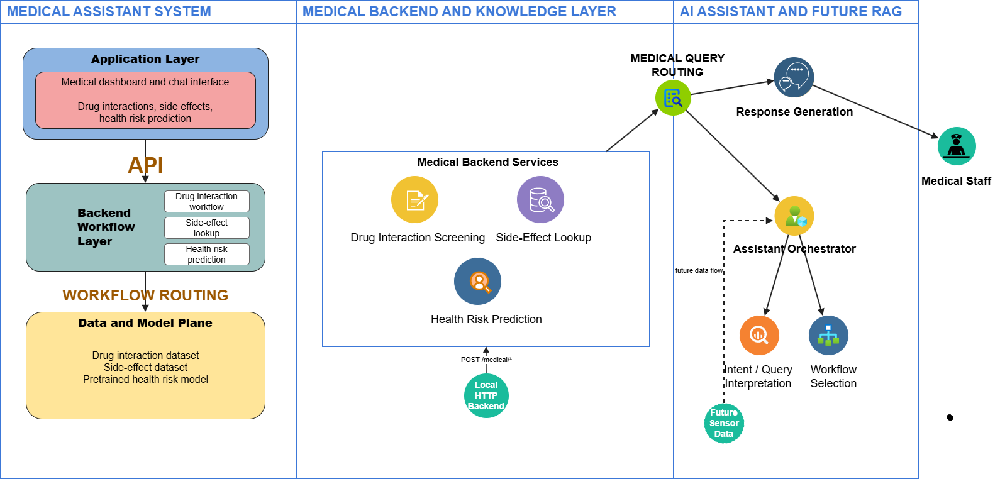

# Medical Assistant Prototype

A web-based medical assistant for structured drug safety support, side-effect lookup, and health risk prediction. The current system combines a chat-oriented interface with deterministic backend workflows, local medical repositories, and a pretrained risk model.



## Features

- **Medical Chat Interface** - Natural-language interaction through the `/medical` page for medication safety and risk-related questions
- **Drug Interaction Checking** - Pairwise medication interaction checks from structured local datasets
- **Side-Effect Lookup** - Drug side-effect retrieval with grouped outputs such as common effects and serious warning signs
- **Health Risk Prediction** - Risk estimation from tabular vital-sign inputs using a pretrained model
- **Medical Concept Help** - Basic support for common clinical abbreviations and vital-sign terminology
- **Controlled Response Flow** - Deterministic workflows are used as the primary path instead of unrestricted medical generation
- **Fallback Rewriting** - Gemini can be used for limited fallback assistance or response rewriting when configured

## Tech Stack

- **Frontend**: Next.js UI in `src/ui`
- **Backend**: Persistent Python backend via `scripts/run_medical_backend.py`
- **Routing**: Medical request routing in `src/router/medical_chat_graph.py`
- **Schemas**: Structured request and response models in `src/schemas`
- **Workflows**: Core medical services in `src/services`
- **LLM Fallback**: Gemini for limited fallback and rewriting support

## Getting Started

### Prerequisites

- Python with Poetry
- Node.js
- npm

### Setup

```bash
# Install Python dependencies
poetry install

# Install UI dependencies
cd src/ui
npm install
```

Set up `src/ui/.env`:

```env
DATABASE_URL="file:./dev.db"
NEXTAUTH_SECRET="your-secret-key-here"
NEXTAUTH_URL="http://localhost:3000"
MEDICAL_BACKEND_URL="http://127.0.0.1:8010"

GEMINI_API_KEY="your-gemini-api-key"
GEMINI_MODEL="gemini/gemini-flash-latest"
```

Start the backend:

```bash
poetry run python scripts/run_medical_backend.py
```

Start the UI:

```bash
cd src/ui
npm run dev
```

If Turbopack causes issues on Windows:

```bash
npx next dev --webpack
```

Open [http://localhost:3000/medical](http://localhost:3000/medical) to use the medical assistant.

## Current Behavior

The current production emphasis is on bounded, explainable workflows:

- Drug interactions and side effects use structured dataset lookups
- Health risk prediction uses a pretrained model
- Medical concept help uses the local glossary first
- Gemini is only used when fallback support or response rewriting is needed
- Retrieval-augmented diagnosis support remains ongoing work and is not yet the main production workflow

## Project Structure

```text
src/
|-- router/
|   `-- medical_chat_graph.py      # Medical request routing and orchestration
|-- schemas/                       # Medical request and response schemas
`-- services/                      # Core medical workflow logic

src/ui/
`-- src/
    `-- app/
        `-- api/
            `-- medical/           # Medical-facing API routes

scripts/
`-- run_medical_backend.py         # Persistent Python backend for medical workflows

```

## Architecture Overview

The medical assistant currently follows this flow:

```text
UI (/medical) -> Medical API routes -> Python backend -> Workflow services
                                               -> Local repositories / risk model
                                               -> Chat-oriented response
```

This design supports a controlled medical assistant rather than a general diagnostic chatbot.
