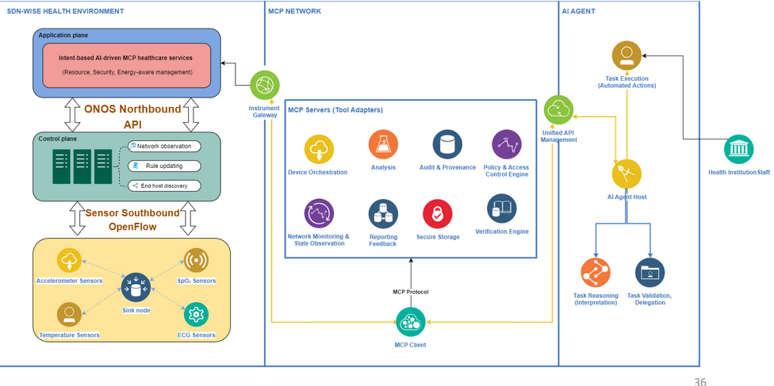

<div align="center">

# LLM-Based Intent Orchestration for Medical IoT Environments

### Healthcare-Oriented Privacy-Preserving Platform for Electronic Health Record Reliable Sharing (HOPPERS)

[](https://python.org)
[](https://fastapi.tiangolo.com)
[](https://nextjs.org)
[](https://crewai.com)
[](https://docs.google.com/presentation/d/1dIFfxO6JmQFQiGihexDT0RxHEQ_-1zaR/edit?slide=id.p1#slide=id.p1)

**Laboratoire IBISC (Informatique, Bioinformatique, Systèmes Complexes EA 4526)**  
*Université Évry Paris-Saclay*

[D4Gen Hackathon Presentation](https://docs.google.com/presentation/d/1dIFfxO6JmQFQiGihexDT0RxHEQ_-1zaR/edit?slide=id.p1#slide=id.p1)

</div>

---

## Overview

Modern medical research laboratories increasingly integrate smart workspace environments with diverse IoT devices and services. However, clinicians, nurses, and researchers—typically non-IT specialists—require intuitive mechanisms to express their operational intents without manual device configuration. Large Language Models (LLMs) offer promising capabilities in reasoning, planning, and task orchestration, enabling seamless automation of data retrieval, analysis, and workflow execution.

This repository represents the **within-institutional management component** (AIoT subsystem) of the HOPPERS platform, focusing on medical IoT device orchestration to build a complete secure and automated smart environment for healthcare institutions. The complete solution integrates AIoT data collection with secure inter-institutional data sharing mechanisms.

> [!NOTE]
> This repository focuses on the **AIoT and SDN-based in-hospital data management** components. The blockchain-based secure data transmission layer for inter-institutional sharing is maintained in a separate repository.



---

## Application Scenarios

### Scenario 1: In-Hospital Clinical Decision Support

AI-assisted diagnostic recommendations leveraging historical and real-time patient records from sensor/actuator data collection systems. The system integrates:
- **Real-time data acquisition** from medical IoT sensors (ECG, temperature, blood pressure)
- **RAG (Retrieval-Augmented Generation) model** for medication prediction and diagnosis support
- **LLM-based reasoning** to assist healthcare professionals in clinical decision-making

> [!IMPORTANT]
> Healthcare professionals retain final decision authority to validate and correct potential AI-generated errors. The system serves as a clinical decision support tool, not an autonomous diagnostic system.

### Scenario 2: Smart Hospital BioIoT Management 

Autonomous orchestration of medical IoT sensors and actuators to enhance hospital operational efficiency:
- **Camera-based monitoring** systems detect resident falls and emergency situations
- **Autonomous sensor management** for continuous vital sign monitoring
- **SDN-based network orchestration** for dynamic data flow management
- **Energy-aware device scheduling** to optimize hospital infrastructure performance

> [!TIP]
> The SDN layer (Mininet-WiFi + ONOS controller) enables programmable network management, allowing dynamic traffic isolation, priority-based data routing, and real-time adaptation to changing hospital conditions.

---

## Product Prototype Versions

| Version | Type | Features | Scenario | Video Demo |
|---------|------|----------|----------|------------|
| **Alpha v1.0.1** | Initial Alpha | Application interface, dashboard functionality | Scenario 2 | [▶ Basic Function View](docs/demo/alpha101.webm) |
| **Alpha v1.0.2** | Alpha Update | RAG model for medication prediction | Scenario 1 | [▶ RAG Model Demo](docs/demo/alpha102.mp4) |
| **Alpha v1.0.3** | Alpha Update | Generative AI for network management | Scenario 2 | [▶ Network Function Demo](docs/demo/alpha103.webm) |
| **Alpha v1.0.4** | Alpha Update | Full web application functionalities | All scenarios | [▶ Full Functionality View](https://www.youtube.com/watch?v=25nDVT_wcZk) |

---

## System Architecture

The system architecture integrates multiple components to enable LLM-driven intent orchestration for medical IoT environments:

```
┌─────────────────────────────────────────────────────────────────┐
│                    AIoT Smart Hospital Ecosystem                 │
│                                                                 │
│  ┌──────────────────┐   ┌──────────────────┐   ┌─────────────┐ │
│  │  ESP32 Sensors   │   │  TinyLLM Edge    │   │  RAG Model  │ │
│  │  (ECG, Temp,     │──▶│  Inference       │   │  Clinical   │ │
│  │   BP, SpO2)      │   │  & Alerts        │   │  Support    │ │
│  └────────┬─────────┘   └──────────────────┘   └─────────────┘ │
│           │                                                      │
│  ┌────────▼──────────────────────────────────────────────────┐  │
│  │         Mininet-WiFi Hospital Network Simulation          │  │
│  │              ONOS SDN Controller (Layer 3)                 │  │
│  │      Programmable Network Flow Management & QoS            │  │
│  └────────┬──────────────────────────────────────────────────┘  │
│           │                                                      │
│  ┌────────▼──────────────────────────────────────────────────┐  │
│  │         FastAPI Backend + FastMCP Server                   │  │
│  │    CrewAI Multi-Agent Orchestration (Gemini LLM)          │  │
│  │      Intent Parsing → Task Planning → Execution            │  │
│  └────────┬──────────────────────────────────────────────────┘  │
│           │                                                      │
│  ┌────────▼──────────────────────────────────────────────────┐  │
│  │            Next.js Web Dashboard                           │  │
│  │   Real-time Monitoring, Control & Visualization UI         │  │
│  └────────────────────────────────────────────────────────────┘  │
└─────────────────────────────────────────────────────────────────┘
```

> [!NOTE]
> **Key Architectural Components:**
> - **AIoT Layer**: ESP32-based physical sensors for real-time vital sign monitoring
> - **Edge Intelligence**: TinyLLM models deployed at edge devices for local inference and alert generation
> - **SDN Orchestration**: Mininet-WiFi simulation with ONOS controller for programmable network management
> - **LLM Orchestration**: CrewAI framework with Gemini LLM for natural language intent understanding and multi-agent coordination
> - **Clinical Support**: RAG model integrating medical knowledge bases for diagnosis assistance
> - **Data Management**: InfluxDB for time-series sensor data storage and retrieval

---

## Quick Setup

### Prerequisites

> [!IMPORTANT]
> **Required Software Versions:**
> - Python **3.12.x** (Poetry enforces `>=3.12.0,<3.13`)
> - Node.js **18+** for Next.js frontend
> - Poetry for Python dependency management
> - pnpm for Node.js dependency management

**Installation Steps:**
- Install **pipx**: [github.com/pypa/pipx](https://github.com/pypa/pipx)
- Install **Poetry**: [python-poetry.org/docs](https://python-poetry.org/docs)
- Install **pnpm**: [pnpm.io/installation](https://pnpm.io/installation)
- Install **Node.js**: [nodejs.org](https://nodejs.org)

### Backend Installation

```bash
# Verify Poetry installation
poetry --version

# Install Python dependencies
poetry install --no-root

# Check virtual environment
poetry env list

# Activate environment (Poetry 2.x)
source $(poetry env info --path)/bin/activate

# Or for Poetry 1.x
poetry shell
```

### Environment Configuration

```bash
# Copy and configure environment variables
cp .env.template .env
# Required: GEMINI_API_KEY=<your-google-gemini-api-key>
```

> [!WARNING]
> Never commit your `.env` file to version control. It is already listed in `.gitignore` to prevent accidental exposure of API keys and credentials.

### Running the Application

```bash
# Terminal 1 — Start the FastAPI backend + FastMCP server
poetry run uvicorn src.main:app --host 0.0.0.0 --port 8001

# Terminal 2 — Start the Next.js frontend
cd src/ui && pnpm install && pnpm dev
```

The web dashboard will be available at **http://localhost:3000**.

> [!TIP]
> For development purposes, the backend API documentation is accessible at **http://localhost:8001/docs** (Swagger UI) and **http://localhost:8001/redoc** (ReDoc).

---

## Project Structure

```
llm-intent-orchestration/
├── src/
│   ├── main.py                  # FastAPI application entry point + FastMCP server
│   ├── crew.py                  # Multi-agent CrewAI orchestration logic
│   ├── agents/
│   │   ├── agents.py            # LLM agent definitions (Gemini-based)
│   │   └── prompts/             # System prompt templates for intent parsing
│   ├── tasks/                   # Intent routing and task definitions
│   ├── api/                     # REST API route handlers
│   ├── services/                # Business logic layer (device management, data processing)
│   ├── repositories/            # Data access layer (database operations)
│   ├── schemas/                 # Pydantic models for data validation
│   ├── db/                      # Database configuration and initialization
│   ├── mininet/                 # Mininet-WiFi SDN network simulation scripts
│   ├── onos/                    # ONOS SDN controller integration modules
│   ├── router/                  # FastAPI router configuration
│   └── ui/                      # Next.js web dashboard frontend
│       ├── src/                 # Frontend React components and pages
│       └── prisma/              # Database schema definitions (Prisma ORM)
├── data/                        # Medical datasets (Kaggle) for RAG model training
├── docs/
│   ├── general-architecture/    # System architecture diagrams
│   ├── demo/                    # Demonstration video recordings
│   └── medical/                 # Medical domain reference documentation
├── models/                      # Machine learning model artifacts (RAG, TinyLLM)
├── tests/                       # Unit and integration tests
├── tools/                       # Utility scripts and helper functions
├── scripts/                     # Automation and deployment scripts
├── pyproject.toml               # Python dependencies managed by Poetry
├── package.json                 # Node.js dependencies for frontend
└── .env.template                # Environment variable template (copy to .env)
```

> [!NOTE]
> **Key Directories:**
> - **`src/agents/`**: Contains LLM agent logic using CrewAI framework for multi-agent orchestration
> - **`src/mininet/`** and **`src/onos/`**: SDN network simulation and controller integration for hospital network management
> - **`src/ui/`**: Complete Next.js web application for real-time monitoring and device control
> - **`data/`**: Medical datasets used for training RAG models (not included in repository, download from Kaggle)
> - **`models/`**: Pre-trained and fine-tuned model artifacts for edge deployment

---

## Technology Stack

| Component | Technology | Purpose |
|-----------|------------|---------|
| **LLM Framework** | Google Gemini | Natural language intent parsing and reasoning |
| **Agent Orchestration** | CrewAI 1.10 + LangGraph | Multi-agent coordination and workflow management |
| **MCP Protocol** | FastMCP | Model Context Protocol server for tool integration |
| **Backend API** | FastAPI + Uvicorn | RESTful API and WebSocket server |
| **Frontend** | Next.js + Tailwind CSS | Real-time monitoring dashboard |
| **SDN Controller** | ONOS | Software-defined networking for hospital infrastructure |
| **Network Simulation** | Mininet-WiFi | Wireless hospital network topology simulation |
| **Edge AI** | TinyLLM | Lightweight LLM for on-device sensor monitoring |
| **RAG Pipeline** | LangChain + Gemini | Retrieval-augmented generation for clinical decision support |
| **Time-Series Database** | InfluxDB | Medical sensor data storage and analytics |
| **ORM** | Prisma | Type-safe database access layer |
| **IoT Devices** | ESP32 | Physical medical sensor prototypes |

---

## Research Context and Future Directions

This project is developed within the **Paris-Saclay innovation ecosystem** at the **Laboratoire IBISC (EA 4526)**, Université Évry Paris-Saclay, as part of the **D4Gen 2026 Hackathon** organized by Genopole.

> [!NOTE]
> **Academic Trajectory:**
> - **Current Phase**: D4Gen Hackathon prototype demonstration (June 2026)
> - **Summer 2026**: Participation in SUI Hackathon EPFL, AFS Youth Assembly innovation events
> - **Conference Publication**: ESORICS (European Symposium on Research in Computer Security, A-core conference) with focus on zk-SNARK circuit design and optimization
> - **Future Work**: IEEE journal publication (2027) on privacy-preserving AIoT architectures for healthcare
> - **Long-term Vision**: Scalable SaaS platform deployment across European healthcare institutions

### Scientific Contributions

1. **Intent-based Network Automation**: LLM-driven orchestration for medical IoT devices using natural language interfaces
2. **Privacy-Preserving Data Collection**: Secure in-hospital data management with institutional governance
3. **SDN-based Hospital Networks**: Programmable network infrastructure for dynamic medical data flow control
4. **Edge Intelligence**: TinyLLM deployment for real-time monitoring and alert generation at IoT edge devices
5. **Clinical Decision Support**: RAG-based AI assistance maintaining healthcare professional oversight

> [!IMPORTANT]
> **Research Ethics and Compliance:**
> - All medical data used in this prototype is sourced from public datasets (Kaggle)
> - The system is designed for research and demonstration purposes only
> - Clinical deployment would require regulatory approval (CE marking, FDA clearance, etc.)
> - Patient data privacy is ensured through institutional governance and access control mechanisms

---

## Team

| Name | Role | Institution |
|------|------|------------|
| **Huyen-Trang Le** | Team Leader · AIoT Architecture & LLM Orchestration | IBISC, Université Évry Paris-Saclay |
| **Nguyen-Huong-Giang Le** | Backend Development & System Integration | IBISC, Université Évry Paris-Saclay |
| **Massinissa Hamidi** | SDN Network Simulation & ONOS Controller | IBISC, Université Évry Paris-Saclay |

---

## References

### MCP and CrewAI Framework
1. **MCP SDK Integration**: [modelcontextprotocol.io/docs/sdk](https://modelcontextprotocol.io/docs/sdk)
2. **CrewAI Task Automation**: [docs.crewai.com/en/mcp/overview](https://docs.crewai.com/en/mcp/overview)
3. **CrewAI Tutorial**: [youtu.be/sPzc6hMg7So](https://www.youtube.com/watch?v=sPzc6hMg7So)
4. **MCP Learning Resources**: [youtu.be/QIOk4XZ5XNU](https://youtu.be/QIOk4XZ5XNU)
5. **CrewAI + FastMCP Integration**: [github.com/ashishpatel26/Crewai-MCP-Course](https://github.com/ashishpatel26/Crewai-MCP-Course)
6. **LangChain MCP Adapters**: [langchain-mcp-adapters](https://github.com/langchain-ai/langchain-mcp-adapters)
7. **ONOS MCP Server** *(code inspiration)*: [onos-mcp-server](https://github.com/MCP-Mirror/davidlin2k_onos-mcp-server)

### Academic Publications — Intent-Based Network Automation
8. Njah, Y., et al. (2023). "Toward intent-based network automation for smart environments: A healthcare 4.0 use case." *IEEE Access*, 11, 136565-136576. [DOI](https://doi.org/10.1109/ACCESS.2023.3338165)
9. Sun, S., et al. (2025). "SmartIntent: A Serverless LLM-Oriented Architecture for Intent-Driven Building Automation." *IEEE CloudCom*.

### Academic Publications — Software-Defined Networking (SDN)
10. Mostafaei, H., & Menth, M. (2018). "Software-defined wireless sensor networks: A survey." *Journal of Network and Computer Applications*, 119, 42-56. [DOI](https://doi.org/10.1016/j.jnca.2018.06.016)
11. Olivier, F., Gonzalez, C., & Nolot, F. (2015). "SDN based architecture for clustered WSN." *2015 9th International Conference on Innovative Mobile and Internet Services in Ubiquitous Computing* (pp. 342-347). IEEE.
12. Kazi, B. U., et al. (2025). "A Survey on Software Defined Network-Enabled Edge Cloud Networks: Challenges and Future Research Directions." *Network*, 5(2), 16.
13. Orozco-Santos, F., et al. (2021). "Enhancing SDN WISE with Slicing Over TSCH." *Sensors*, 21(4), 1075. [DOI](https://doi.org/10.3390/s21041075)

### Academic Publications — Healthcare IoT and Medical Sensors
14. Upadhyay, S., et al. (2023). "Challenges and limitation analysis of an IoT-dependent system for deployment in smart healthcare using communication standards features." *Sensors*, 23(11), 5155. [DOI](https://doi.org/10.3390/s23115155)
15. Recmanik, M., et al. (2024). "A review of patient bed sensors for monitoring of vital signs." *Sensors*, 24(15), 4767. [DOI](https://doi.org/10.3390/s24154767)
16. Ocagli, H., et al. (2024). "In-Bed Monitoring: A Systematic Review of the Evaluation of In-Bed Movements Through Bed Sensors." *Informatics*, 11(4). MDPI.
17. Guerrero-Ulloa, G., et al. (2020). "IoT-based smart medicine dispenser to control and supervise medication intake." *Intelligent Environments 2020* (pp. 39-48). IOS Press.
18. Scarpato, N., et al. (2017). "E-health-IoT universe: A review." *Management*, 21(44), 46.
19. Kelechi, A. H., et al. (2022). "Design of a low-cost air quality monitoring system using arduino and thingspeak." *Computers, Materials & Continua*, 70, 151-169.

### Academic Publications — Electronic Health Records (EHR)
20. Kataria, S., & Ravindran, V. (2020). "Electronic health records: a critical appraisal of strengths and limitations." *Journal of the Royal College of Physicians of Edinburgh*, 50(3), 262-268. [DOI](https://doi.org/10.4997/JRCPE.2020.309)

### Academic Publications — LLM-Based Multi-Agent Systems
21. Li, Z., et al. (2024). "Autoflow: Automated workflow generation for large language model agents." *arXiv preprint* arXiv:2407.12821.
22. Yang, Y., et al. (2025). "Agentnet: Decentralized evolutionary coordination for llm-based multi-agent systems." *arXiv preprint* arXiv:2504.00587.

> [!NOTE]
> **Additional Reading:**  
> For comprehensive background on blockchain-based secure data transmission (inter-institutional sharing component), zero-knowledge proofs (zk-SNARKs), and privacy-preserving mechanisms, please refer to the blockchain subsystem repository and our ESORICS conference paper (forthcoming).

---

<div align="center">

*Built with dedication at **Université Évry Paris-Saclay · Laboratoire IBISC (EA 4526)***  
*D4Gen 2026 Hackathon — Smart Healthcare Ecosystem Challenge*  
*Genopole · Paris-Saclay Innovation Ecosystem*

</div>